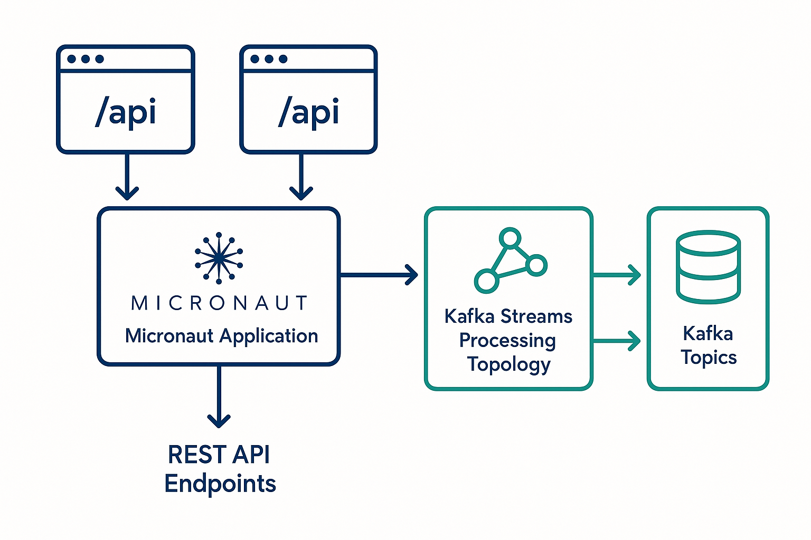

# Developing Real-Time Event Processing with Micronaut and Kafka Streams: A Step-by-Step Guide

_Learn how to develop lightweight, high-performance stream processing applications in Java with contemporary frameworks_

Real-time data processing is paramount in many modern applications across multiple domains, from monitoring financial transactions to analytics on Internet of Things (IoT) sensor data. Although historical solutions required the implementation of a complex distributed system involving possibly many JVMs, we are able to create a more simplistic yet powerful solution for stream processing by using Micronaut and Kafka Streams in combination.

This tutorial will demonstrate how to develop a full real-time word counting application that will cover the important foundational areas of stream processing and it will also use modern best practices to create a simple executable jar that can be deployed easily.

## Why Micronaut + Kafka Streams?

Before we get to coding our application, it is essential to understand why this combination is one that many developers are now considering for stream processing applications.

### Micronaut Benefits

Micronaut is a new framework that instead of doing dependency injection and configuration at runtime, will process both at compile-time. This has a number of advantages for microservices and stream processing applications.


_Figure 1: Key benefits of using Micronaut for stream processing applications_

The benefits include:

**Fast startup time**: as there is no reflection processing because it is done at compile-time

**Reduced memory**: fewer runtime dependencies and smaller bytecode

**More cloud-friendly**: built for container based and serverless environments

**Improved developer experience**: shorter development cycles due to shorter restarts

### Kafka Streams: Stream Processing without the need to maintain separate clusters

Because Kafka Streams allows for stream processing code to be executed as a library in the application rather than relying on some sort of cluster, operational overhead is reduced. Key advantages consist of:

**No separate infrastructure**: Library running as part of your application

**Exactly-once processing**: Data consistency guarantees built-in

**Automatic scaling**: Additional instances to increase throughput

**Fault-tolerance**: Automatic recovery of state and re-balancing

## Architecture Overview

The application follows a clean architecture pattern, with REST APIs handling communication to the outside world and Kafka Streams managing the real-time processing pipeline.


_Figure 2: High-level architecture of our Micronaut + Kafka Streams application_

Data flows:

1. REST API that accepts text messages
2. Messages are sent to Kafka Topics
3. The messages are processed in real-time by Kafka Streams
4. The results are saved to state stores and output topics
5. Query APIs allow for access to the processed results

## What We're Actually Building

Now that we understand the why, let's talk about the what. We're building a word counting application that might seem simple on the surface, but it demonstrates all the core patterns you'll need for more complex stream processing scenarios.

Here's what our application will do in practice: when you send a text message through our REST API, it gets broken down into individual words, counted in real-time, and stored so you can query how many times any word has appeared. Think of it like a real-time analytics dashboard, but for words instead of user clicks or financial transactions.

The beauty of this approach is that the same patterns work whether you're counting words, tracking user behavior, or processing financial transactions. The topology stays conceptually the same, you just change the data models and processing logic.

What makes this particularly interesting is that everything runs in a single JVM. No separate stream processing cluster, no complex deployment orchestration. Just a regular Java application that happens to be really good at processing streams of data.

## Setting Up the Development Environment

Let's get started by setting up our development environment. We will use Docker Compose to run Kafka locally, which simplifies development by providing consistency.

### Prerequisites

- Java 17 or later
- Docker and Docker Compose
- A text editor

### Set-up Infrastructure

There is a full Docker Compose configuration in the [project repository](https://github.com/mahitha-ada/kafka-streams), which has:

- Kafka broker, with auto-topic creation
- Zookeeper, for cluster coordination
- Local development with proper networking configuration

Start-up the infrastructure:

```bash
git clone https://github.com/mahitha-ada/kafka-streams.git
cd kafka-streams
docker compose up -d
```

## Creating the Micronaut Project

The [repository](https://github.com/mahitha-ada/kafka-streams) contains a complete Micronaut project that has support for Kafka Streams. The project has important dependencies like:

- **micronaut-kafka-streams**: core Kafka Streams integration
- **jackson-databind**: JSON serialization support
- **jackson-datatype-jsr310**: support for Java 8 time types for JSON serialization
- **micronaut-http-server-netty**: implementation of HTTP server

**Note**: You need to include the dependency on the jackson-datatype-jsr310 in order for you to be able to handle `java.time.Instant` and other Java 8 time types in your message models.

## Configuration That Makes It Work

Before we dive into the code, let's get the configuration sorted out. This is where a lot of tutorials go wrong - they show you the code but leave you guessing about the configuration that actually makes everything work together.

The key configuration points in [`application.yml`](https://github.com/mahitha-ada/kafka-streams/blob/main/kafka-streams-demo/src/main/resources/application.yml):

**Application ID**: Your Kafka Streams application will have a unique ID. This is important because Kafka uses this to track which consumer group your application belongs to and where it left off processing.

**Exactly-once semantics**: This guarantees that each record will be processed exactly once, even if your application crashes and restarts. It's a bit more overhead, but worth it for most applications.

**Commit interval**: This controls how often the state store gets flushed to disk. Lower values mean more up-to-date queries but higher I/O overhead.

**Bootstrap servers**: This is how your application connects to the Kafka cluster. In production, you'd have multiple servers here for redundancy.

## Constructing the Stream Processing Pipeline

The foundation of our application is the Kafka Streams topology that describes the flow of data through the processing pipeline. This is where the real magic happens.

### Kafka Streams Topology

The full implementation can be found in [`WordCountStream.java`](https://github.com/mahitha-ada/kafka-streams/blob/main/kafka-streams-demo/src/main/java/com/example/streams/WordCountStream.java). The topology does this:

1. **Read messages**: We create a stream from the `text-messages` topic
2. **Split into words**: Each message gets split into individual words
3. **Group and count**: We group by word and count occurrences
4. **Store results**: The counts are stored in a state store called `word-counts-store`
5. **Output results**: Finally, we send the results to the `word-counts` topic

The key insight here is that this processing happens continuously. As new messages arrive, word counts get updated in real-time, and you can query the current state at any time.

### Data Models

The application uses clean data models for type safety. We have [`TextMessage.java`](https://github.com/mahitha-ada/kafka-streams/blob/main/kafka-streams-demo/src/main/java/com/example/model/TextMessage.java) for input and [`WordCount.java`](https://github.com/mahitha-ada/kafka-streams/blob/main/kafka-streams-demo/src/main/java/com/example/model/WordCount.java) for output. The `@Introspected` annotation allows Micronaut's compile time reflection to improve performance.

### Custom Serialization

One thing that trips up a lot of people is serialization. The built-in Kafka serdes only work with primitive types, so for custom objects we need custom serialization. We handle this with a [`JsonSerde`](https://github.com/mahitha-ada/kafka-streams/blob/main/kafka-streams-demo/src/main/java/com/example/serde/JsonSerde.java) class that uses Jackson under the hood.

## REST API Integration

Stream processing handles the data transformation, but REST APIs provide the interface for external systems to interact with our application.

### Key Controllers

There are two primary controllers in the application:

[**MessageController.java**](https://github.com/mahitha-ada/kafka-streams/blob/main/kafka-streams-demo/src/main/java/com/example/controller/MessageController.java) handles message ingestion. It's a simple POST endpoint that accepts text messages and sends them to Kafka.

[**WordCountController.java**](https://github.com/mahitha-ada/kafka-streams/blob/main/kafka-streams-demo/src/main/java/com/example/controller/WordCountController.java) provides query access to results. You can query individual word counts or get the top N words.

### Service Layer

The service layer encapsulates our Kafka interaction logic:

[**MessageService.java**](https://github.com/mahitha-ada/kafka-streams/blob/main/kafka-streams-demo/src/main/java/com/example/service/MessageService.java) handles Kafka producer integration - it takes messages from the REST API and publishes them to Kafka topics.

> **Important Implementation Note**: Our working implementation uses a direct `KafkaProducer<String, String>` rather than Micronaut's `@KafkaClient` interface. This ensures reliable JSON string serialization and avoids common issues where messages appear to be sent successfully but arrive as null values in the Kafka Streams processor.

[**WordCountService.java**](https://github.com/mahitha-ada/kafka-streams/blob/main/kafka-streams-demo/src/main/java/com/example/service/WordCountService.java) provides the state store query interface - it lets you query the current word counts from the Kafka Streams state store.

## Testing the Application

### Running the Application

Before testing the application, you need to create the required Kafka topics:

```bash
docker exec -it kafka kafka-topics --create \
  --topic text-messages \
  --bootstrap-server localhost:9092 \
  --partitions 3 \
  --replication-factor 1
```

You can run the application with:

```bash
./gradlew run
```

You should see that the application is starting up in a few seconds and is ready to process messages on localhost:8082.

### API Testing

The basic flow for testing:

**Send message:**

```bash
curl -X POST http://localhost:8082/api/messages \
  -H 'Content-Type: application/json' \
  -d '{"content": "hello world hello kafka streams", "userId": "user123"}'
```

**Query word counts (with expected responses):**

```bash
# Should return {"word":"hello","count":2}
curl http://localhost:8082/api/wordcounts/hello

# Should return {"word":"kafka","count":1}
curl http://localhost:8082/api/wordcounts/kafka

# Should return {"word":"streams","count":1}
curl http://localhost:8082/api/wordcounts/streams
```

**Test incremental counting:**

```bash
# Send another message
curl -X POST http://localhost:8082/api/messages \
  -H 'Content-Type: application/json' \
  -d '{"content": "hello beautiful world"}'

# Check updated count - should return {"word":"hello","count":3}
curl http://localhost:8082/api/wordcounts/hello
```

Please see the [`TESTING.md`](https://github.com/mahitha-ada/kafka-streams/blob/main/TESTING.md) for full instructions for testing.

### Verification That It Works

Once you have the application running, you can verify the complete pipeline:

```bash
# 1. Send a test message
curl -X POST http://localhost:8082/api/messages \
  -H "Content-Type: application/json" \
  -d '{"content": "realtime stream processing works perfectly"}'

# 2. Verify word counting (should see count=1 for each word)
curl http://localhost:8082/api/wordcounts/realtime
curl http://localhost:8082/api/wordcounts/stream
curl http://localhost:8082/api/wordcounts/processing

# 3. Send another message to test incremental counting
curl -X POST http://localhost:8082/api/messages \
  -H "Content-Type: application/json" \
  -d '{"content": "stream processing is amazing"}'

# 4. Verify counts incremented (should see count=2 for "stream" and "processing")
curl http://localhost:8082/api/wordcounts/stream
curl http://localhost:8082/api/wordcounts/processing
```

If you see the word counts updating correctly, your stream processing pipeline is working end-to-end!

## Common Gotchas and Remedies

There were real-world experiences along the way that uncovered some common problems and remediation approaches. These are the issues that will definitely bite you if you're not prepared for them.

### Jackson Time Serialization Problems

**Problem**: When deserializing `java.time.Instant` field and `JsonMappingException` occurs.

This happens because Jackson doesn't know how to handle Java 8 time types by default. You'll see errors like "Cannot construct instance of java.time.Instant" when your application tries to deserialize messages.

**Remedy**: Add the JSR310 module dependency and register it with your ObjectMapper. The complete solution is in the [GitHub repository](https://github.com/mahitha-ada/kafka-streams/blob/main/kafka-streams-demo/src/main/java/com/example/serde/JsonSerde.java).

### Producer Implementation Issues

**Problem**: Messages are sent via REST API but Kafka Streams shows "Processing JSON: null" or doesn't process messages at all.

This is a critical issue that can be frustrating because the REST API appears to work (returns success), but the stream processing pipeline receives null values. The problem typically stems from issues with the Micronaut `@KafkaClient` interface not properly serializing JSON strings as Kafka message values.

**Symptoms you'll see:**

- REST API returns successful message IDs
- No errors in application logs during message sending
- Kafka Streams debug logs show "Processing JSON: null"
- Word counts remain at 0 despite sending messages
- No exceptions thrown, making it hard to diagnose

**Root Cause**: The `@KafkaClient` interface in Micronaut can have issues with parameter binding and serialization, especially when sending JSON strings as message values.

**Remedy**: Use a direct `KafkaProducer<String, String>` implementation instead of the `@KafkaClient` interface. The complete working implementation can be found in [MessageService.java](https://github.com/mahitha-ada/kafka-streams/blob/main/kafka-streams-demo/src/main/java/com/example/service/MessageService.java).

Key points of the solution:

- Configure Kafka producer directly with Properties
- Use `StringSerializer` for both key and value serialization
- Create `ProducerRecord<String, String>` with JSON string as the message value
- This ensures JSON strings are properly sent as Kafka message values and can be consumed by Kafka Streams

This approach ensures that JSON strings are properly sent as Kafka message values and can be consumed by Kafka Streams.

### Topic Creation

**Problem**: Application does not start with "topic does not exist" errors.

This is one of those things that works fine in development but breaks in production. Kafka can auto-create topics, but it doesn't always work the way you expect, especially with specific partition and replication requirements.

**Remedy**: Always ensure the topics are created prior to starting the application with the proper partition and replication settings.

### State Store Not Operational

**Problem**: Application does not start after an ungraceful shutdown.

Kafka Streams maintains local state stores on disk. If your application crashes or gets killed ungracefully, these state stores can become corrupted. You'll see errors about "state directory not found" or "corrupted state store".

**Remedy**: Implement proper cleanup policies and health checks. See [`TROUBLESHOOTING.md`](https://github.com/mahitha-ada/kafka-streams/blob/main/TROUBLESHOOTING.md) for detailed recovery procedures. In development, you can usually just delete the state directory and restart.

### Test Configuration Problems

**Problem**: Test runs have state directory conflicts.

When you run tests, each test might try to use the same state directory, causing conflicts. This is especially problematic if you're running tests in parallel.

**Remedy**: Create separate test configuration in `src/test/resources/application-test.yml` with different application IDs and state directories.

### Memory Use

**Problem**: High memory consumption for very large state stores.

State stores are kept in memory for fast access, but they can grow large over time. If you're processing millions of unique keys, you might run into memory issues.

**Remedy**: Configure appropriate cache sizes and use windowed operations for time-based data. For word counting, you might want to use time-windowed counts instead of global counts.

### Topic Configuration

**Problem**: High throughput processing lag due to insufficient partitions.

If your topic only has one partition, all messages get processed by a single thread, which limits throughput. You'll notice processing lag building up over time.

**Remedy**: Ensure that your topic has enough partitions for the expected throughput. A good rule of thumb is one partition per expected concurrent consumer.

## Next Steps

In this tutorial, we have covered the basics of building real time stream processing applications using Micronaut and Kafka Streams. You are now on the foundation to begin building more complex applications.

Here are some directions you might want to explore:

**Add windowed operations for time based analytics**: Instead of counting all words ever, you might want to count words in the last hour or day. Kafka Streams has excellent support for time-windowed operations.

**Implement joins over multiple streams**: You can join streams together to correlate data from different sources. For example, you might join user messages with user profile information.

**Add schema registry for compliance**: For production systems, you'll want to use a schema registry to manage data format evolution over time.

**Add metrics and health checks**: Monitoring is crucial for production stream processing applications. Micronaut has excellent support for metrics and health checks.

## Conclusion

You have a simple yet powerful approach to building real-time stream processing applications using Micronaut and Kafka Streams. By leveraging compile-time enhancements and embedded stream processing, you can build systems that are both performant and operationally simple.

The combination works well because it eliminates a lot of the operational complexity that comes with traditional stream processing platforms. You don't need to manage separate clusters, worry about complex deployment orchestration, or deal with the networking issues that come with distributed systems.

For the complete source code and documentation, see the [GitHub repository](https://github.com/mahitha-ada/kafka-streams) where you will have access to:

- The complete working application code
- Docker Compose environment for local development
- Full test examples ([`TESTING.md`](https://github.com/mahitha-ada/kafka-streams/blob/main/TESTING.md))
- Troubleshooting guide ([`TROUBLESHOOTING.md`](https://github.com/mahitha-ada/kafka-streams/blob/main/TROUBLESHOOTING.md))

The patterns you've learned here scale up well to more complex scenarios. Whether you're processing financial transactions, IoT sensor data, or user behavior events, the fundamental approach remains the same. You just change the data models and processing logic to fit your specific use case.
