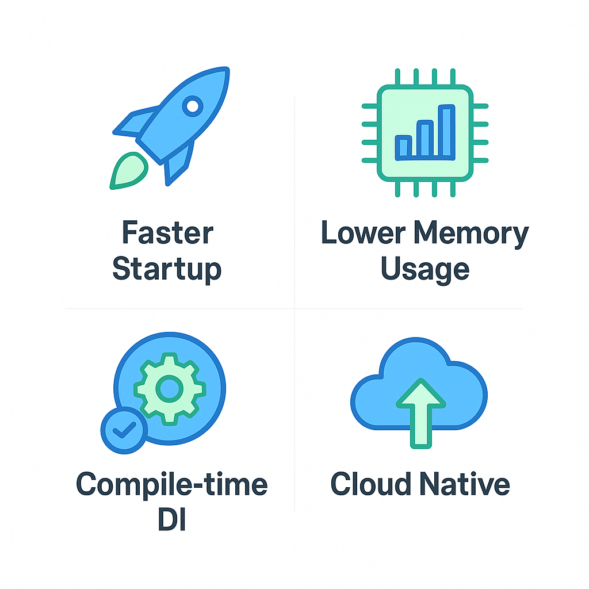
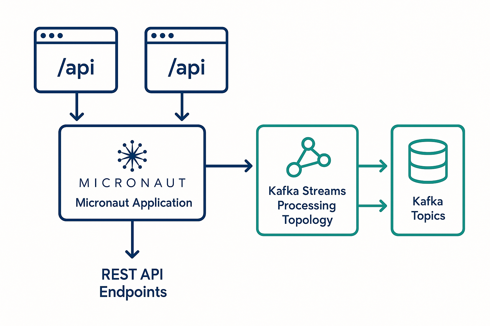
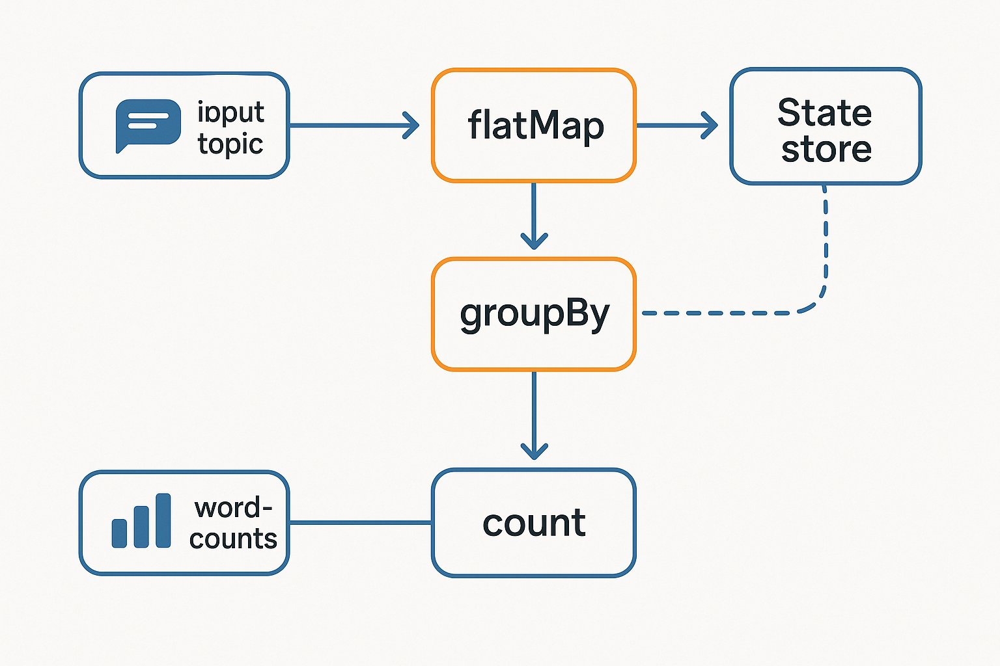

# Building Real-Time Event Processing with Micronaut and Kafka Streams: A Practical Tutorial

_Learn how to build lightweight, high-performance stream processing applications using modern Java frameworks_

---

Real-time data processing has become essential for modern applications, from financial transaction monitoring to IoT sensor analytics. While traditional solutions often require complex distributed systems, combining Micronaut with Kafka Streams offers a surprisingly simple yet powerful approach.

In this tutorial, we'll build a complete real-time word counting application that demonstrates the core concepts of stream processing while maintaining the simplicity of a single deployable JAR file.

## Why Micronaut + Kafka Streams?

Before diving into the implementation, let's understand why this combination is gaining traction among developers building stream processing applications.

### The Micronaut Advantage

Micronaut takes a different approach from traditional Java frameworks by performing dependency injection and configuration at compile time rather than runtime. This design choice leads to several benefits for microservices and stream processing applications.


_Figure 1: Key benefits of using Micronaut for stream processing applications_

Key advantages include:

- **Faster startup times**: Compile-time processing eliminates runtime reflection overhead
- **Lower memory footprint**: Reduced runtime dependencies and optimized bytecode
- **Better cloud compatibility**: Designed for containerized and serverless environments
- **Improved developer experience**: Faster development cycles due to quicker restarts

### Kafka Streams: Stream Processing Without the Complexity

Kafka Streams eliminates the need for separate processing clusters. Your stream processing logic runs as a library within your application, making deployment and operations much simpler.

Key benefits include:

- **No separate infrastructure**: Runs as a library within your application
- **Exactly-once processing**: Built-in guarantees for data consistency
- **Automatic scaling**: Add more instances to increase throughput
- **Fault tolerance**: Automatic state recovery and rebalancing

## Architecture Overview

Our application follows a clean architecture pattern where REST APIs handle external interactions while Kafka Streams manages the real-time processing pipeline.


_Figure 2: High-level architecture of our Micronaut + Kafka Streams application_

The data flow is straightforward:

1. REST API receives text messages
2. Messages are published to Kafka topics
3. Kafka Streams processes messages in real-time
4. Results are stored in state stores and output topics
5. Query APIs provide access to processed results

## Setting Up the Development Environment

Let's start by setting up our development environment. We'll use Docker Compose to run Kafka locally, making development simple and consistent.

### Prerequisites

- Java 17 or higher
- Docker and Docker Compose
- Your favorite IDE

### Infrastructure Setup

The complete Docker Compose configuration is available in the project repository. It includes:

- Kafka broker with auto-topic creation
- Zookeeper for cluster coordination
- Proper networking configuration for local development

Start the infrastructure:

```bash
git clone https://github.com/your-repo/micronaut-kafka-streams-demo
cd micronaut-kafka-streams-demo
docker compose up -d
```

### Creating the Micronaut Project

The repository includes a complete Micronaut project generated with Kafka Streams support. Key dependencies include:

- `micronaut-kafka-streams`: Core Kafka Streams integration
- `jackson-databind`: JSON serialization support
- `jackson-datatype-jsr310`: Java 8 time support for JSON serialization
- `micronaut-http-server-netty`: HTTP server implementation

**Important**: The `jackson-datatype-jsr310` dependency is crucial for handling `java.time.Instant` and other Java 8 time types in your message models.

## Building the Stream Processing Pipeline

The core of our application is the Kafka Streams topology that defines how data flows through our processing pipeline.

### Kafka Streams Topology


_Figure 3: Word counting stream processing topology_

The complete implementation is available in `WordCountStream.java`. The topology:

1. **Reads** text messages from the input topic
2. **Splits** each message into individual words
3. **Groups** words by their value
4. **Counts** occurrences of each word
5. **Stores** results in a state store for querying
6. **Outputs** results to a topic for downstream processing

### Data Models

The application uses clean data models for type safety:

- `TextMessage.java`: Input message structure
- `WordCount.java`: Output result structure

The `@Introspected` annotation enables Micronaut's compile-time reflection, contributing to the framework's performance advantages.

## REST API Integration

While stream processing handles the data transformation, REST APIs provide the interface for external systems to interact with our application.

### Key Controllers

The application includes two main controllers:

- `MessageController.java`: Handles message ingestion
- `WordCountController.java`: Provides query interface for results

### Service Layer

The service layer encapsulates Kafka interaction logic:

- `MessageService.java`: Kafka producer integration
- `WordCountService.java`: State store query interface

## Configuration

The application configuration is defined in `application.yml`. Key configuration points include:

- **Application ID**: Uniquely identifies your Kafka Streams application
- **Exactly-once processing**: Ensures each record is processed exactly once
- **Commit interval**: Controls state store flush frequency
- **Bootstrap servers**: Kafka cluster connection details

## Testing the Application

### Starting the Application

```bash
# Create required Kafka topics first
docker exec -it kafka kafka-topics --create \
  --topic text-messages \
  --bootstrap-server localhost:9092 \
  --partitions 3 \
  --replication-factor 1

docker exec -it kafka kafka-topics --create \
  --topic word-counts \
  --bootstrap-server localhost:9092 \
  --partitions 3 \
  --replication-factor 1

# Start the application
./gradlew run
```

The application should start quickly and be ready to process messages on port 8082.

### API Testing

Basic test flow:

```bash
# Send a message
curl -X POST http://localhost:8082/api/messages \
  -H "Content-Type: application/json" \
  -d '{"content": "hello world hello kafka streams", "userId": "user123"}'

# Query word count
curl http://localhost:8082/api/wordcounts/hello

# Get top words
curl http://localhost:8082/api/wordcounts?limit=5
```

For comprehensive testing instructions, see the included `TESTING.md` guide.

## Common Gotchas and Solutions

Based on real-world experience, here are common issues and their solutions:

### Jackson Time Serialization Issues

**Problem**: `JsonMappingException` when deserializing `java.time.Instant` fields.

**Solution**: Add the JSR310 module dependency and register it:

```gradle
implementation("com.fasterxml.jackson.datatype:jackson-datatype-jsr310")
```

```java
@Override
public ObjectMapper objectMapper() {
    ObjectMapper mapper = super.objectMapper();
    mapper.registerModule(new JavaTimeModule());
    return mapper;
}
```

### Topic Creation

**Problem**: Application fails to start with "topic does not exist" errors.

**Solution**: Ensure topics are created before starting the application:

```bash
# Create required topics with proper partitioning
docker exec -it kafka kafka-topics --create \
  --topic text-messages \
  --bootstrap-server localhost:9092 \
  --partitions 3 \
  --replication-factor 1
```

### State Store Corruption

**Problem**: Application fails to start after unclean shutdown.

**Solution**: Implement proper cleanup policies and health checks. See the `TROUBLESHOOTING.md` guide for detailed recovery procedures.

### Test Configuration Issues

**Problem**: Tests fail with state directory conflicts.

**Solution**: Create separate test configuration in `src/test/resources/application-test.yml`:

```yaml
kafka:
  streams:
    default:
      application:
        id: kafka-streams-demo-test
      state:
        dir: /tmp/kafka-streams-test
```

And use the test environment in your test classes:

```java
@MicronautTest(environments = "test")
class YourTest {
    // test code
}
```

### Memory Management

**Problem**: High memory usage with large state stores.

**Solution**: Configure appropriate cache sizes and use windowed operations for time-based data.

### Topic Configuration

**Problem**: Processing lag due to insufficient partitions.

**Solution**: Ensure your topics have enough partitions for your expected throughput.

## Next Steps

This tutorial covered the basics of building real-time stream processing applications with Micronaut and Kafka Streams. To extend this foundation:

1. **Add windowed operations** for time-based analytics
2. **Implement joins** between multiple streams
3. **Add schema registry** for better data governance
4. **Integrate monitoring** with health checks and metrics

## Conclusion

The combination of Micronaut and Kafka Streams provides a powerful yet simple approach to building real-time stream processing applications. By leveraging compile-time optimizations and embedded stream processing, you can build systems that are both performant and operationally simple.

The complete source code and documentation are available in the GitHub repository, including:

- Complete working application code
- Docker Compose setup for local development
- Comprehensive testing examples (`TESTING.md`)
- Troubleshooting guide (`TROUBLESHOOTING.md`)

---

_About the Author: Mahitha Adapa is a Principal Architect with extensive experience in cloud migrations and microservices architecture. She has successfully migrated 80+ applications to the cloud and specializes in building scalable, high-performance systems._
